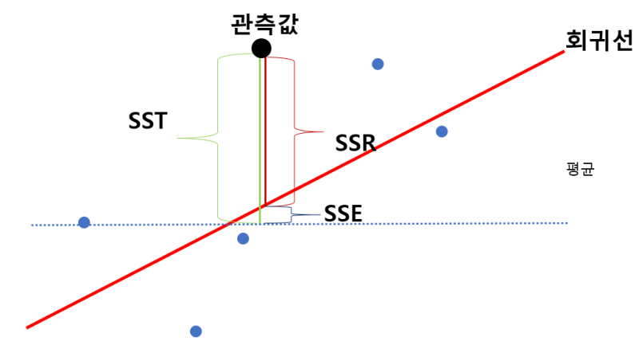
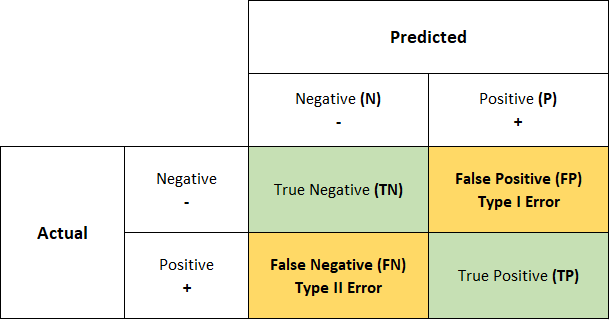
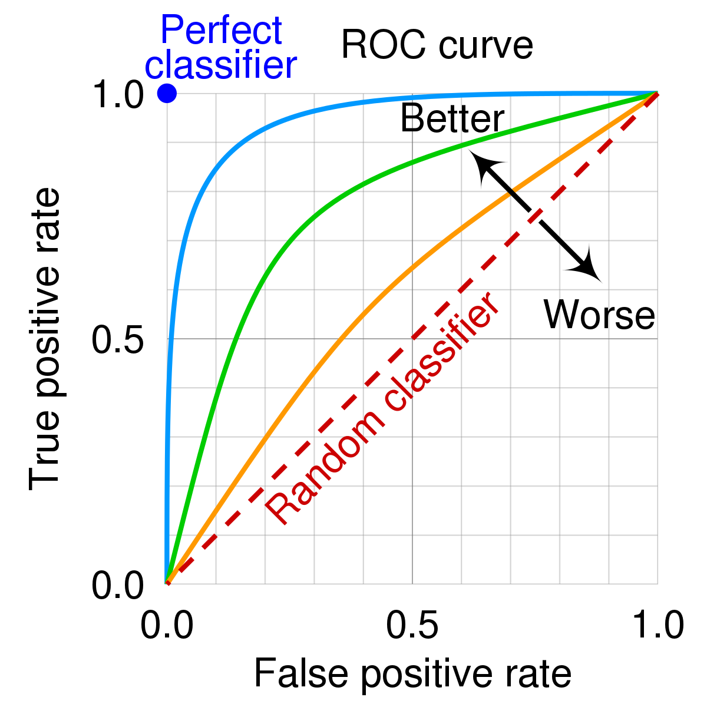
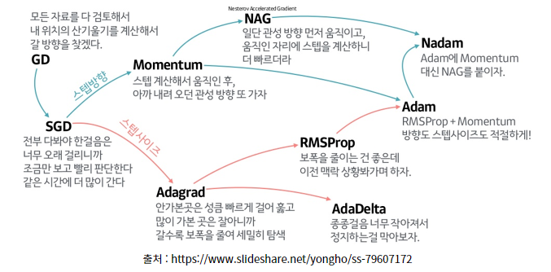

# 분석 모형 평가

## 회귀 모형 평가
* 주요 평가 지표
    * 평균절대오차 (Mean Absolute Error, MAE)
    * 평균제곱오차 (Mean Squared Error, MSE)
    * 평균제곱근오차 (Root Mean Squared Error, RMSE)
    * 평균절대백분율오차 (Mean Absolute Percentage Error)

* 선형회귀모형의 결정계수
    * $R^2=\frac{SSR}{SST}=1-\frac{SSE}{SST}$

    

## 분류 모형 평가
* confusion matrix

    

* 주요 평가 지표
    * Accuracy: $\frac{TP + TN}{TP + TN + FP + FN}$
    * Precision: $\frac{TP}{TP + FP}$
    * Recall, Sensitivity: $\frac{TP}{TP + FN}$
    * Specificity: $\frac{TN}{TN + FP}$
    * F1-Score: $2 \times \frac{precision \times recall}{precision + recall}$
    * FPR (False Positive Rate): $\frac{FP}{TN + FP} = 1 - Specificity$
    * TPR (True Positive Rate): $\frac{TP}{TP + FN} = Recall, Sensitivity$

* ROC curve (Receiver Operating Characteristic Curve)

    

## 분석 모형 진단 및 검증
* cross validation
    * K-fold 교차 검증 (K-fold cross validation)
    * 홀드아웃 교차 검증 (Hold-Out cross validation)
    * 리브-p-아웃 교차 검증 (LpOCV, Leave-p-Out Cross Validation)

* 모수 유의성 검정
    * z-test: 추출된 표본이 모집단에 속하는지 검증
    * t-test: 평균값 검증 (1-way), 두 집단의 평균 비교 (2-way)
    * ANOVA (분산분석): 두 개 이상 집단의 평균 비교
    * 카이제곱 검정: 분산을 알고 있을 때 두 집단의 동질성을 검정
    * F-test: 두 모집단 분산 차이가 유의한지 검증

## 매개변수 최적화
train data로부터 loss function의 값을 가장 작게 만드는 매개변수의 최적값을 찾아가는 과정

* 매개변수 최적화 종류
    * 경사하강법 (Gradient Descent): 가중치 매개변수에 대한 손실함수의 기울기를 통해 최적값을 구하는 방법
    * 배치 경사하강법 (Batch Gradient Descent): train data 전체를 대상으로 한 번의 업데이트로 최적값을 구하는 방법
    * 확률적 경사하강법 (Stochastic Gradient Descent, SGD): 무작위로 선택한 1개의 데이터 샘플을 활용하여 최적값을 구하는 방법
    * 미니배치 경사하강법 (Mini-Batch Gradient Descent): 무작위로 선택한 10~1000개의 데이터 샘플을 활용하여 최적값을 구하는 방법
    * 모멘텀 (Momentum): SGD에서 매개변수 변경 방향에 가속도를 부여하는 방식
    * AdaGrad (Adaptive Gradient): 매개변수 값을 업데이트하면서 각 변수마다 learning rate를 다르게 적용하는 방법
    * RMSProp: AdaGrad에서 최적값에 도달하기 전에 learning rate이 0에 가까워지는 상황을 방지하는 방법
    * Adam (Adaptive moment estimation): 모멘텀 + RMSProp, 매개변수의 변경 방향과 폭을 모두 적절하게 조절

    
