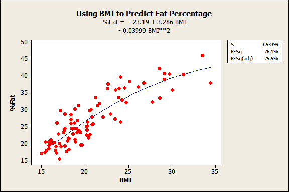
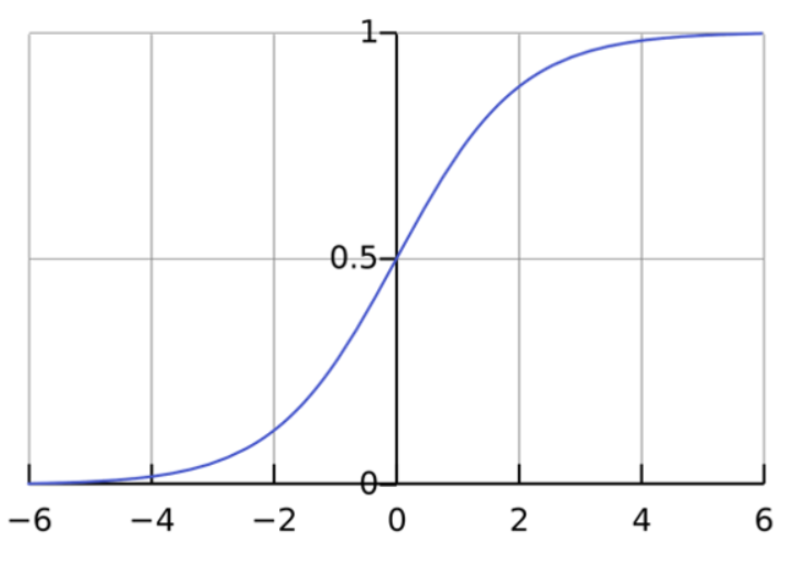
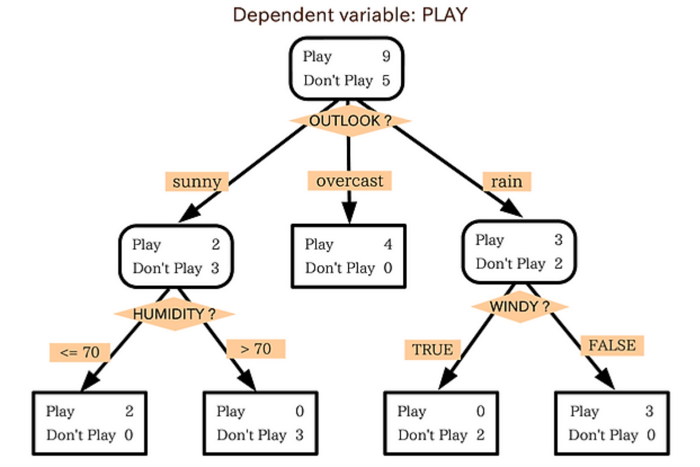
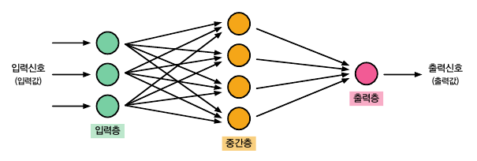
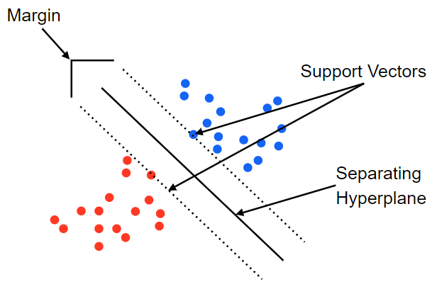

# 분석 모형

## 회귀분석
하나 이상의 독립변수들이 종속변수에 미치는 영향을 추정하는 통계 분석 기법

* 회귀분석의 종류
    * 단순선형회귀: 독립변수가 1개이며 종속변수와 직선인 관계
    * 다중선형회귀: 독립변수가 K개이며 종속변수와 선형인 관계
    * 다항선형회귀: 독립변수와 종속변수의 관계가 1차 함수 이상인 관계
    * 비선형회귀: 회귀식 모양이 선형이 아닌 경우

* 규제가 있는 회귀분석: overfitting의 가능성을 가중치 제한으로 방지하는 해결법
    * 릿지 (Ridge), L2: 계수(기울기)를 제곱하는 방식으로, 영향을 미치지 않는 feature에 대해서는 0에 가까운 가중치를 부여함
    * 라쏘 (Rasso), L1: 계수(기울기)의 절댓값을 취하는 방식으로, feature값의 계수가 매우 낮으면 0으로 수렴하여 해당 feature를 사용하지 않음
    * 엘라스틱넷 (Elastic Net): 릿지와 라쏘의 혼합비율을 활용

## 로지스틱 회귀분석
독립변수의 선형결합을 이용해 사건의 발생 여부를 예측하며, 종속변수가 범주형일 경우에 사용하는 회귀분석

* 로지스틱 회귀분석의 종류
    * 이항 로지스틱 회귀분석: 종속변수의 범주가 두 개인 경우
    * 다항 로지스틱 회귀분석: 종속변수의 범주가 세 개 이상인 경우

## 의사결정 나무
데이터에 존재하는 패턴을 분석하여 나무 모형으로 나타낸 것, 분리 기준에 따라 노드를 분할하고 정지 규칙에 이르면 트리의 성장을 제한

## 인공신경망
뉴런의 전기신호 전달 과정을 모방한 기계학습 모델

* 인공신경망의 종류
    * 단층 퍼셉트론: 입력층과 출력층을 중심으로 구성된 퍼셉트론
    * 다층 퍼셉트론: 여러 개의 hidden layer와 back propagation을 이용하여 단층 퍼셉트론을 발전시킨 것

* 활성화함수의 종류
    * 시그모이드 (sigmoid)
    * ReLU
    * Leaky ReLU
    * Tanh

* 딥러닝 응용 분야
    * CNN (합성곱 신경망, Convolution Neural Network): 이미지 처리에 특화딘 딥러닝 알고리즘
    * RNN (순환신경망, Recurrent Neural Network): 시계열 데이터, 언어 데이터와 같은 순차적인 데이터 학습에 특화됨
    * LSTM (장단기 메모리, Long Short Term Memory): RNN의 장기 의존성 문제를 보완하여 불필요한 과거 정보는 삭제하고 중요한 정보는 장기 기억하여 분석에 활용하는 방법
    * GAN (생성적 적대 신경망, Generative Adversarial Network): 적대, 대립하는 두 개의 신경망을 활용하여 가짜 데이터를 생성함으로써 데이터의 불균형, 부족 문제를 해결할 수 있는 분석 방법

## 서포트 벡터 머신
데이터를 분리하는 초평면 중에서 데이터들과 가장 거리가 먼 초평면을 분리하는 지도학습 기반 선형 분류모델

## 군집화
변수 유사성에 기초하여 N개의 군집으로 집단화하는 비지도학습 기법

* 군집화의 종류
    * 계층적 군집 분석: 유사한 개체들끼리 묶어 나가는 과정을 반복하여 원하는 개수의 군집을 형성하는 방법, Top-Down 방식과 Bottom-Up 방식이 있음
    * 비계층적 군집 분석: 계층 없이 최적의 그룹을 계속해서 찾아나가는 방법

## 연관분석
데이터에 존재하는 항목 간의 상호관계와 종속관계를 찾아내는 비지도학습 기법

* 연관분석의 주요 지표
    * 지지도: 전체 상품 중 x와 y를 함께 구매할 비율
    * 신뢰도: x를 구매한 사람 중 y를 함께 구매한 비율
    * 향상도: 규칙이 우연에 의해 발생한 것인지 판단하는 연관성의 정도

## 앙상블 분석
모델 성능 향상을 위해 다수 분석 결과를 종합해 최종 결과를 도출하는 방법

* 배깅 (Bagging)
    * Bootstrap sampling으로 여러 표본을 추출해 병렬 학습 후 결과 집계
    * 데이터 사이즈가 작을 때 유리하며, 성능 향상에 효과적
    * e.g., 랜덤포레스트
* 부스팅 (Boosting)
    * 모델을 점진적으로 발전시켜 나가는 방식, 예측력이 약한 모형을 순차적으로 결합하여 점점 예측력이 강한 모형으로 발전시킴
    * e.g., AdaBoost (Adaptive Boosting), GBM (Gradient Boosting Machine), XGBoost, LightGBM
